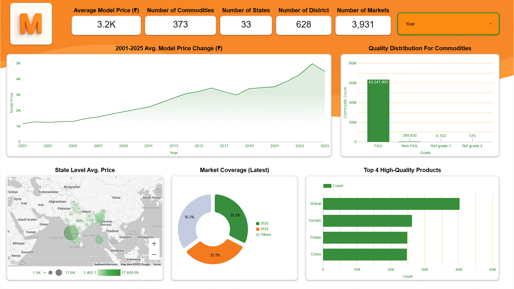

# 🇮🇳 India Agricultural Commodity Price Analysis & Forecasting

## 📌 Proje Özeti (Project Overview)

Bu proje, **Hindistan’daki tarımsal emtia fiyatlarını** günlük piyasa verileri kullanarak
(2001–2025) analiz etmektedir.  
Projenin temel amacı;

- Uzun vadeli **price trend**’leri,
- **seasonality (mevsimsellik)** etkilerini,
- **monsoon (muson)** dönemlerinin fiyatlar üzerindeki etkisini incelemek
- ve **2026–2027 dönemi için price forecasting** modelleri oluşturmaktır.

Çalışma; büyük ölçekli veri temizleme, keşifsel veri analizi (EDA),
time series modeling, makroekonomik şok analizi ve
interaktif dashboard görselleştirmelerini kapsamaktadır.

---

## 📊 Dashboard Önizleme (Dashboard Preview)

---

## 🎯 Proje Amaçları (Objectives)

- Büyük ölçekli commodity price verilerinin temizlenmesi ve ön işlenmesi  
- State ve market bazında fiyat trendlerinin analiz edilmesi  
- Mevsimsellik, muson ve makro şokların fiyatlar üzerindeki etkisinin ölçülmesi  
- **Time Series Forecasting** modelleri ile gelecek dönem fiyat tahminlerinin oluşturulması  

---

## 🛠️ Kullanılan Araçlar & Teknolojiler (Tools & Technologies)

- **Python** (Pandas, NumPy, Matplotlib, Statsmodels)  
- **Time Series Analysis**  
- **Google BigQuery**  
- **Looker Studio**  

---

## 🗂️ Dashboard İçeriği (Dashboard Structure)

Dashboard toplam **5 ana analiz katmanından** oluşmaktadır:

### 1️⃣ Overview Page (KPI Page)
- Commodity, state ve market bazlı temel KPI’lar  
- Ortalama fiyat seviyeleri ve uzun dönem trend görünümü  
- Veri kapsamı: ürün, eyalet, ilçe ve market sayıları  

---

### 2️⃣ Price Trends & Volatility Analysis
- Uzun vadeli fiyat trendleri (2001–2025)  
- Price spread ve volatility ilişkisi  
- Yüksek riskli ürünlerin belirlenmesi  

---

### 3️⃣ Monsoon Impact Analysis
- Muson ve muson dışı dönem fiyat karşılaştırmaları  
- Muson dönemlerinde volatilite ve fiyat artışı ölçümü  
- Ürün bazlı muson hassasiyeti analizi  

---

### 4️⃣ Regional & Market Analysis
- State ve market bazında fiyat dağılımları  
- Bölgesel arz–talep farklarının analizi  
- Coğrafi fiyat yoğunluk haritaları  

---

### 5️⃣ Forecasting & Prediction Page
- Time series modelleri ile **2026–2027 price forecasts**  
- Gerçek vs tahmin fiyat karşılaştırmaları  
- Ürün bazlı tahmin belirsizliği ve risk değerlendirmesi  

---

## 🌍 Makro Düzeyde Analiz (Macro-Level Analysis)

Tarımsal ürün fiyatları, yalnızca yerel arz–talep dengesiyle değil;
**enflasyon, enerji maliyetleri, arz şokları ve makroekonomik dalgalanmalar**
ile doğrudan ilişkilidir.

Analiz sonuçları, yüksek enflasyon dönemlerinde:
- **Price spread**’in genişlediğini,
- **Volatility**’nin eş zamanlı olarak arttığını göstermektedir.

Bu bulgular, tarımsal ürün piyasalarındaki dalgalanmanın önemli bir bölümünün
**makroekonomik baskılardan** kaynaklandığını ortaya koymaktadır.

---

## ⚠️ Fiyat Dalgalanması & Risk Analizi

Volatility ve price spread arasındaki ilişki incelendiğinde,
yüksek fiyat farklarının her zaman yüksek volatiliteye neden olmadığı
görülmektedir.

Model sonuçları, spread’in volatiliteyi **nedensel olarak artırmadığını**,
aksine volatilitenin çoğu zaman iklim, arz şokları ve makro koşullar
tarafından tetiklendiğini göstermektedir.

Bu durum, fiyat riskinin yalnızca piyasa içi mekanizmalarla değil;
**dışsal şoklarla** da şekillendiğini ortaya koymaktadır.

---

## 🌧️ Monsoon Impact Analysis

Muson sezonu, Hindistan tarımı için **yapısal bir fiyat belirleyicisidir**.

Analizler, muson dönemlerinde:
- Ortalama fiyatların yükseldiğini,
- Volatilitenin anlamlı şekilde arttığını,
- Etkinin ürün bazında farklılaştığını göstermektedir.

Bazı ürünler muson etkisine yüksek duyarlılık gösterirken,
bazı ürünlerde bu etki sınırlı kalmaktadır.
Bu durum, **ürün bazlı risk sınıflandırmasının** önemini vurgulamaktadır.

---

## 🤖 Forecasting Insights

Forecasting modelleri, geçmiş fiyat dalgalanmalarını başarılı şekilde
takip etmektedir; ancak **aşırı fiyat artışı öngörüsünden bilinçli olarak
kaçınılmaktadır**.

Model çıktıları:
- Bazı ürünlerde dengeli ve yatay bir fiyat bandına,
- Yüksek volatiliteye sahip ürünlerde ise artan tahmin belirsizliğine
işaret etmektedir.

Bu nedenle forecast sonuçları,
**kesin fiyat tahmini değil; trend yönü ve risk sinyali**
olarak yorumlanmalıdır.

---

## 🦠 COVID-19 Shock Analysis

COVID-19 dönemi, tarımsal ürün fiyatlarında **yapısal bir kırılma**
yaratmıştır.

Analizler göstermektedir ki:
- Fiyat seviyeleri COVID sonrası eski seviyelerine dönmemiştir.  
- Volatility ve spread, COVID sonrası dönemde kalıcı olarak yükselmiştir.  
- Bu durum, geçici bir şoktan ziyade **kalıcı bir fiyat rejimi değişimine**
işaret etmektedir.

COVID etkisi, tarımsal ürün piyasalarında uzun vadeli fiyat artışlarının
önemli bir tetikleyicisidir.

---

## 💡 İş Önerileri (Business Recommendations)

1. **Yüksek volatiliteye sahip ürünlerde** kısa vadeli arz ve stok planlaması
kritik önemdedir.  
2. **Muson etkisi yüksek bölgelerde**, tedarik zinciri planlaması muson
takvimine göre yapılmalıdır.  
3. Temel gıda ürünlerinde uzun vadeli fiyat stabilitesi,
politika ve sübvansiyon planlamalarında dikkate alınmalıdır.  
4. Bölgesel fiyat farkları, **lokal market bazlı stratejilerin**
önemini ortaya koymaktadır.  
5. Forecast çıktıları, operasyonel kararlar için
**erken uyarı ve risk göstergesi** olarak değerlendirilmelidir.

---

## 📁 Dataset

Dosya boyutu nedeniyle ham veriler bu repoya yüklenmemiştir.

Bu projede, Hindistan genelinde farklı commodity, state ve market bilgilerini
içeren **India Daily Commodity Prices Dataset (2001–2025)** kullanılmıştır.

**Kaynak (Kaggle):**  
https://www.kaggle.com/datasets/khandelwalmanas/daily-commodity-prices-india

---

## 📊 Çıktılar (Key Outputs)

- Temizlenmiş ve yapılandırılmış veri setleri (2001–2025)  
- Commodity bazlı **2026–2027 fiyat tahminleri**  
- Makro şok, muson ve COVID etkilerini içeren çok katmanlı analizler  
- Looker Studio üzerinden interaktif dashboard ve görsel analizler  

---

## 👤 Author

**Selen**  
Data Analytics & Data Science  
Python • SQL • BigQuery • Looker Studio
